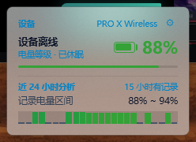
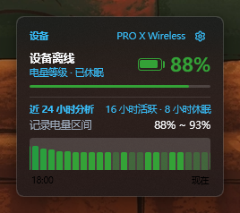
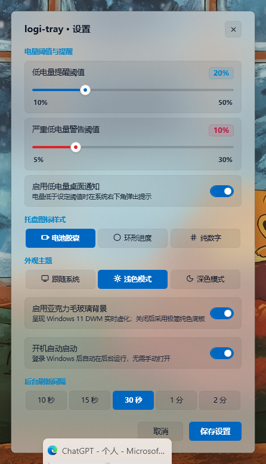
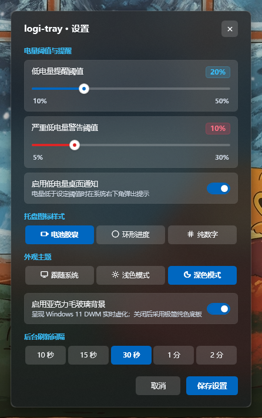
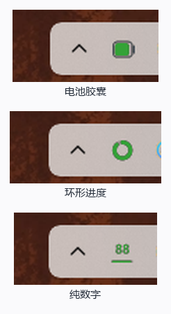
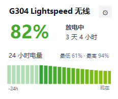
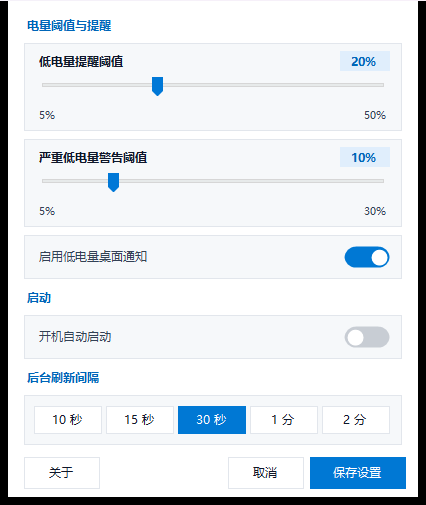

<p align="center">
  
</p>

<h1 align="center">logi-tray</h1>

<p align="center">
  <strong>优雅、极简、现代的 Windows 11 罗技无线鼠标电量托盘与实时 DWM 亚克力监视器</strong>
</p>

<p align="center">
  <a href="https://github.com/yixing233/logi-tray/releases/latest"></a>
  <a href="LICENSE"></a>
  
  
  
</p>

<p align="center">
  无需安装笨重缓慢的 Logitech G HUB，直接在 Windows 任务栏实时掌控鼠标真实电量、放电速率、续航时间与 24 小时电量轨迹。
</p>

<p align="center">
  提供<b>完整版</b>（亚克力毛玻璃 + 三种图标样式）与<b>轻量版</b>（低占用，纯数字图标）两个版本。
</p>

---

## ✨ 核心特性

- 🖱️ **通用罗技硬件支持（基于 HID++ 2.0 工业协议）**
  - 免配对、免配置，自动扫描罗技专属 `VID: 0x046D` 与 `UsagePage: 0xFF00` 通道；
  - 动态识别设备真实型号（如 *PRO X Wireless*、*GPW 1/2/3 代*、*G502 LIGHTSPEED*、*MX Master 3S* 等）；
  - 全面支持 Lightspeed、Unifying（优联）、Bolt 接收器及有线直连双模。
- 🎨 **三种任务栏托盘图标样式自由切换**
  - 🔋 **电池胶囊**：纯图形横向圆角电池，10% 步进纯色平滑填充，随电量多段变色（绿 -> 黄 -> 橙 -> 红）；
  - ⭕ **环形进度**：饱满加粗 3.0px 动感圆环，顺时针展开电量弧线，远视距极度醒目，支持充电闪电指示；
  - 🔢 **纯数字**：大号粗体实时百分比数字，附带底部 2px 细微比例横轨，超远视距一眼可辨。
- 🪟 **原生 Windows 11 DWM 硬件级实时亚克力卡片**
  - 左键点击托盘图标：毫秒级呼出毛玻璃详情卡片，底层窗口与桌面壁纸虚化漫射透出；
  - 搭载专为深浅色背景研发的高辨识度 **「科技天青蓝（Tech Sky Blue）」** 色彩体系，告别传统发灰发暗的字体；
  - 智能自适应底部贴合算法：卡片随内容长短动态收缩，底部到任务栏顶部**恒定保持 8px 黄金间距**。
- 📊 **智能时序 24 小时连续电量直方图**
  - **休眠前向继承（Forward Fill）**：休眠期间沿用休眠前电量并呈现 40% 柔和微透柱，**彻底消灭断崖式归零**；
  - **36px 高饱满度 + 绝对等距**：每根柱宽严格固定 7px、间隙严格固定 2px，均匀如琴键；
  - **智能微放电坡度放大**：自动展开日常微放电斜率，直观呈现电量递减过程；
  - 起止整点清晰标示（如 `17:00` ... `现在`）。
- 🌓 **全功能外观主题自适应**
  - 支持 **💻 跟随系统**、**☀️ 浅色模式**、**🌙 深色模式** 实时热切换；
  - 深色模式搭载 Windows 11 `DWMWA_USE_IMMERSIVE_DARK_MODE` 与黑曜石暗夜亚克力，搭配纯白高对比文字与发光天青蓝标头；
  - 提供 **「启用亚克力毛玻璃背景」开关**，可一键切换为极简纯色底板。
- 🚀 **开机自动启动开关**
  - 设置中心内置「开机自动启动」开关，勾选即刻写入注册表、取消即刻移除，无需重启；
  - 仅写入当前用户 `HKCU\...\Run`，**不申请管理员权限**；
  - 程序被移动到新目录后会自动修正启动项路径。
- 🔔 **低电量桌面预警与阈值管理**
  - 原生 Fluent 无级滑块，支持自由设置低电量（如 20%）及严重低电量（如 10%）阈值；
  - 醒目的 Fluent 胶囊徽章指示，支持 Windows 系统桌面通知。

---

## 📸 界面预览

### 完整版 · 电量详情卡片（真实 DWM 亚克力毛玻璃）

| 浅色模式 | 深色模式 |
| :---: | :---: |
|  |  |

### 完整版 · 现代 Fluent 设置中心

| 浅色模式 | 深色模式 |
| :---: | :---: |
|  |  |

### 完整版 · 三种任务栏托盘图标样式



### 轻量版 · 详情卡片与设置

界面为朴素风格、不含亚克力，但功能完整，占用显著更低。

| 电量详情卡片 | 设置 |
| :---: | :---: |
|  |  |

---

## 🚀 下载与安装

### 前置依赖：.NET 8 桌面运行时

logi-tray 基于 .NET 8 构建，需要微软官方**免费**的桌面运行时。绝大多数 Windows 11 已预装；若未安装，请先下载：

> **📥 [.NET Desktop Runtime 8.0 (x64) 官方下载](https://dotnet.microsoft.com/zh-cn/download/dotnet/8.0)**
>
> 打开页面后选择：**.NET Desktop Runtime 8.0.x → Windows → x64**

安装脚本会自动检测该运行时，缺失时会提示并引导你前往下载页面。

### 下载应用本体

前往 **[Releases 最新发布页面](https://github.com/yixing233/logi-tray/releases/latest)** 下载。提供**两个版本**，按需选择：

| 版本 | 文件 | 内存占用（开窗口） | 适合 |
| --- | --- | --- | --- |
| **完整版** | `logi-tray-v1.0.1.zip`（约 1.6 MB） | 工作集约 141 MB / 提交约 70 MB | 想要亚克力毛玻璃、三种图标样式与主题切换 |
| **轻量版** | `logi-tray-lite-v1.0.0.zip`（约 1.0 MB） | 工作集约 57 MB / 提交约 13 MB | 只要电量数字，希望占用尽可能低 |

两者**共用同一套核心逻辑与配色**，电量读数、阈值判断、历史记录与续航预测完全一致；差别只在界面实现。

> **两个版本可以同时安装、同时运行**，配置与历史数据分别存放在
> `%LOCALAPPDATA%\logi-tray` 与 `%LOCALAPPDATA%\logi-tray-lite`，互不干扰。

#### 版本差异

| 功能 | 完整版 | 轻量版 |
| --- | :---: | :---: |
| 亚克力毛玻璃背景 | ✅ | ❌ 纯色底板 |
| 托盘图标样式 | 电池 / 环形 / 数字 | 仅数字 |
| 外观主题切换 | ✅ 跟随系统 / 浅色 / 深色 | 自动跟随系统 |
| 详情卡片（电量 + 续航 + 24h 图表） | ✅ | ✅ |
| 电量阈值与桌面通知 | ✅ | ✅ |
| 开机自启开关 | ✅ | ✅ |
| 后台刷新间隔 | ✅ | ✅ |
| 关于页与检查更新 | ✅ | ✅ |

轻量版之所以省内存，是因为它**不加载 WPF 渲染栈**（纯 WinForms 实现），而不是把特效关掉——
WPF 的渲染栈在第一次显示窗口后就会常驻进程，这才是完整版内存占用的主要来源。

### 安装方式

解压后，包内已附带全自动脚本（两个版本各自独立，装哪个就运行哪个包里的脚本）：

- **`一键安装.bat`**：自动检测 .NET 8 运行时 → 部署至 `%LOCALAPPDATA%\Programs\logi-tray`（轻量版为 `...\logi-tray-lite`）→ 创建开始菜单与桌面快捷方式 → 配置任务栏托盘常驻可见 → 立即启动（**全程无需管理员 UAC 提权**）；
- **`卸载.bat`**：一键干净清除进程、自启项、快捷方式、程序文件与托盘注册记录。

> 也可以直接双击 `logi-tray.exe`（轻量版为 `logi-tray-lite.exe`）绿色便携运行，不写入任何系统位置。
>
> **开机自启**：安装后打开设置中心，直接拨动「开机自动启动」开关即可，无需额外脚本。

---

## 🛠️ 兼容设备列表（通用支持）

基于罗技官方底层工业级 **HID++ 2.0 协议规范**，程序动态枚举 USB/HID 节点，优先查询 `0x1004` (UnifiedBattery)，设备未实现时回退到 `0x1000` (BatteryStatus)，包括但不限于以下设备：

- **罗技 G 系列游戏无线鼠标**：
  - PRO Wireless (GPW 狗屁王一代)
  - PRO X SUPERLIGHT (GPW 二代)
  - PRO X SUPERLIGHT 2 / DEX (GPW 三代)
  - G502 LIGHTSPEED / G502 X PLUS / G502 X LIGHTSPEED
  - G304 / G305 LIGHTSPEED
  - G703 / G903 / G604 / G603 LIGHTSPEED
- **罗技 MX 办公/人体工学无线鼠标**：
  - MX Master 2S / 3 / 3S
  - MX Anywhere 2S / 3 / 3S
  - MX Vertical / Lift 人体工学鼠标
  - MX Ergo 轨迹球鼠标
- **双模与充电直连**：无线鼠标插上 USB 线充电时，程序无缝识别直连通道并实时显示“正在充电 ⚡”。

---

## 💻 源码编译指南

### 环境要求
- Windows 10 (21H2+) 或 Windows 11
- [.NET 8.0 SDK](https://dotnet.microsoft.com/download/dotnet/8.0)
- Visual Studio 2022 或 C++ 编译器（MSVC / Clang）

### 编译两个界面版本

```powershell
# 克隆仓库
git clone https://github.com/yixing233/logi-tray.git
cd logi-tray

# 完整版（WPF，生成至 wpf/bin/Release/net8.0-windows/）
dotnet build wpf/MouseBatteryTray.csproj -c Release

# 轻量版（WinForms，生成至 lite/bin/Release/net8.0-windows/）
dotnet build lite/LogiTrayLite.csproj -c Release
```

### 项目结构

```
shared/    两个版本共用的核心逻辑（电量轮询、HID 调用、配置、自启、配色）
wpf/       完整版界面（WPF + 亚克力）
lite/      轻量版界面（WinForms）
native/    C++ HID++ 2.0 原生读取程序
```

两个版本通过 `Compile Include="..\shared\*.cs"` 编译**同一份**核心源码，
核心逻辑与配色只有一处定义，不会出现两个版本行为不一致的问题。

### 编译原生 HID++ reader
```bat
cd native
build.bat
```

生成的 `native/build/mouse-tray.exe` 由两个版本共用；构建时会自动复制到各自的输出目录
（缺少它程序会一直显示「设备离线或休眠」）。

### 打包发布

```powershell
python package_release.py
```

会依次构建两个版本，并分别在 `release/` 下生成 `logi-tray-vX.Y.Z.zip` 与
`logi-tray-lite-vX.Y.Z.zip`，各自附带独立的 `一键安装.bat` / `卸载.bat` / `使用说明.txt`。

---

## 📄 开源许可证

本项目基于 **[GNU General Public License v3.0](LICENSE)** 开源。

> 这意味着：你可以自由使用、修改和分发本项目，但**任何基于本项目的衍生作品
> 也必须以 GPL-3.0 开源**，并保留原始版权声明。详见 [LICENSE](LICENSE) 全文。

```
Copyright (C) 2026 yixing233

This program is free software: you can redistribute it and/or modify
it under the terms of the GNU General Public License as published by
the Free Software Foundation, either version 3 of the License, or
(at your option) any later version.

This program is distributed in the hope that it will be useful,
but WITHOUT ANY WARRANTY; without even the implied warranty of
MERCHANTABILITY or FITNESS FOR A PARTICULAR PURPOSE.  See the
GNU General Public License for more details.
```

欢迎提交 Issue 和 Pull Request 一起让它更加完善！
